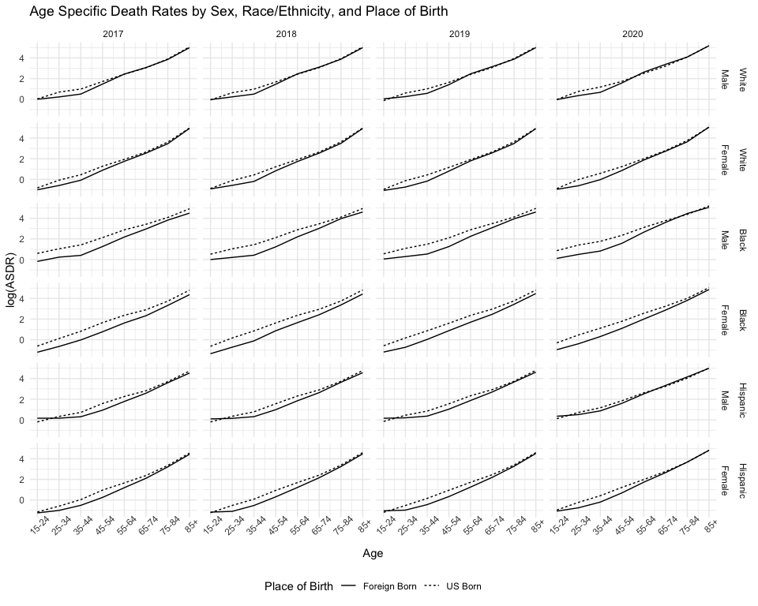
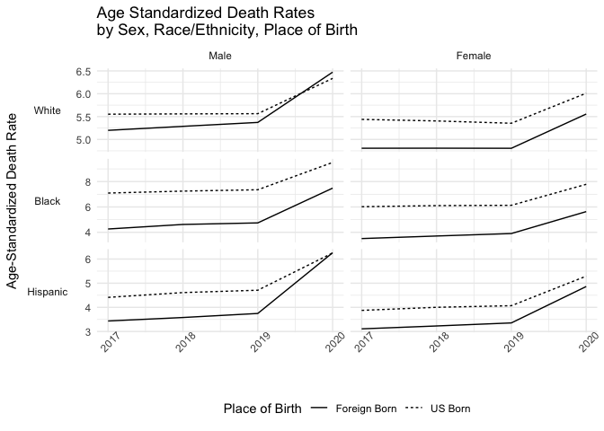
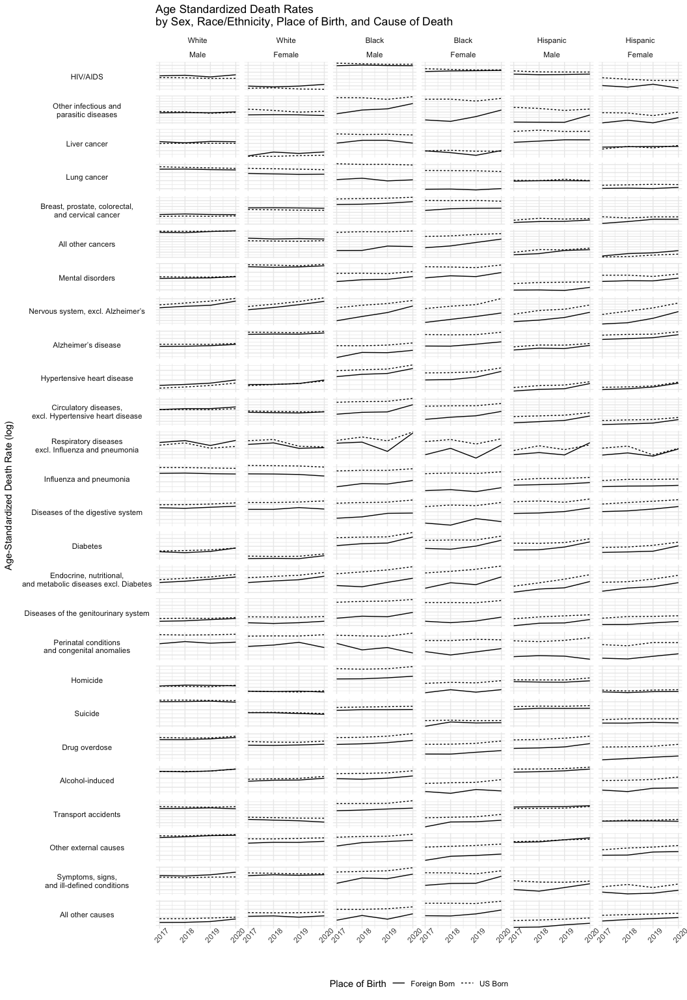
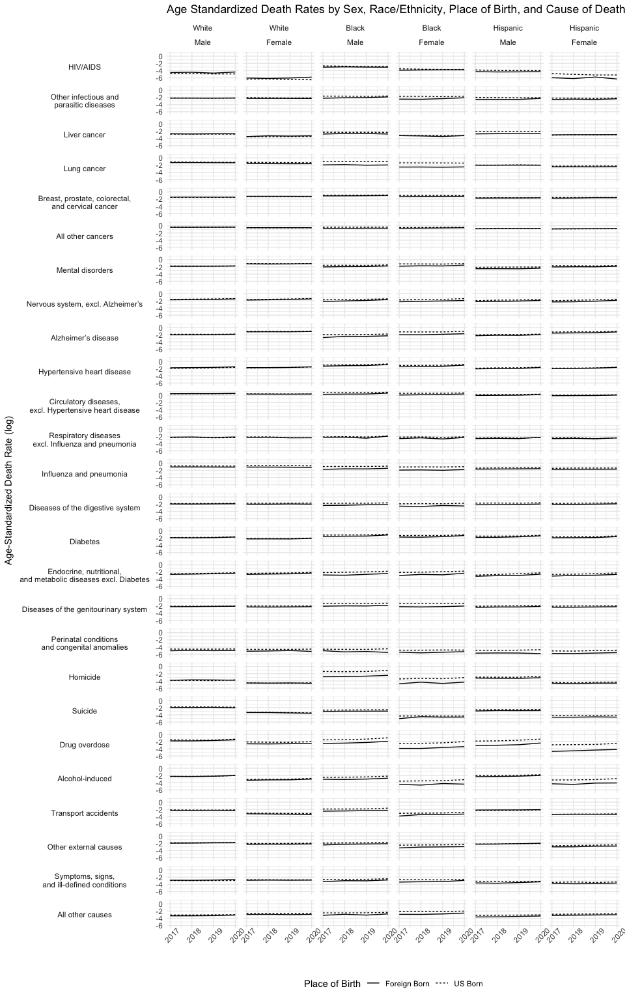
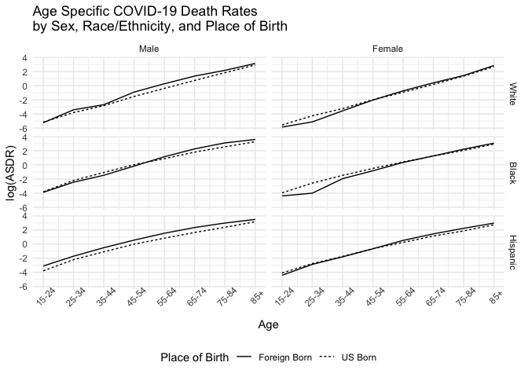
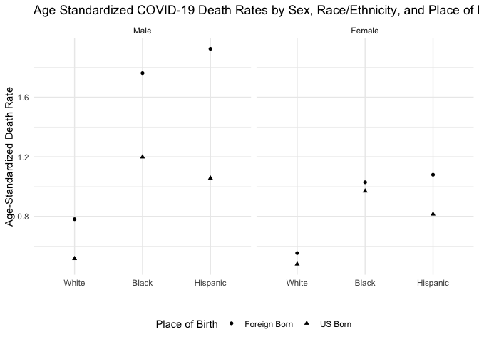

Visualizing Mortality Data
================
Eugenio Paglino

## Data Overview

We start by visualizing the age-specific death rates by sex,
race/ethnicity, and place of birth. We aggregate all causes to keep the
amount of information manageable.

We now plot age-standardized rates by sex, race/ethnicity, and place of
birth. This summary measures obscures difference in age-specific
mortality but is helpful in summarizing mortality differences among
groups. We use the national age distribution (all groups combined) to
standardized the rates.

We now visualize age-standardized death rates by sex, race/ethnicity,
place of birth, and cause of death. In the graph below we let the y-axis
vary across causes of death to make it easier to see the difference
between the groups.

We now create the graph once more fixing the y-axis to better visualize
the differences across causes of death.

## COVID-19 Mortality among Foreign-Born

Here we compare COVID-19 age-specific mortality rates between foreign
born and US born by sex and race/ethnicity.

To make the comparison easier, we now use age-standardized COVID-19
death rates. WE lose the age detail but can more readily compare overall
mortality across groups.

